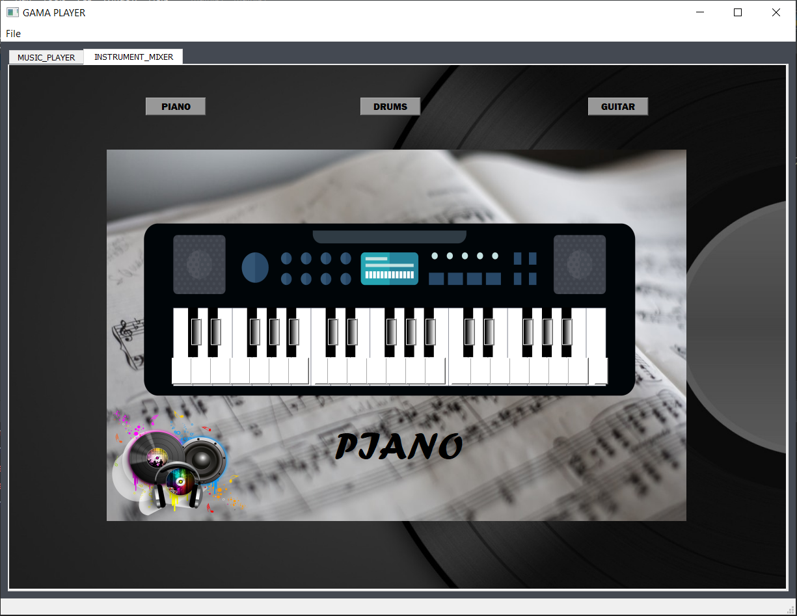
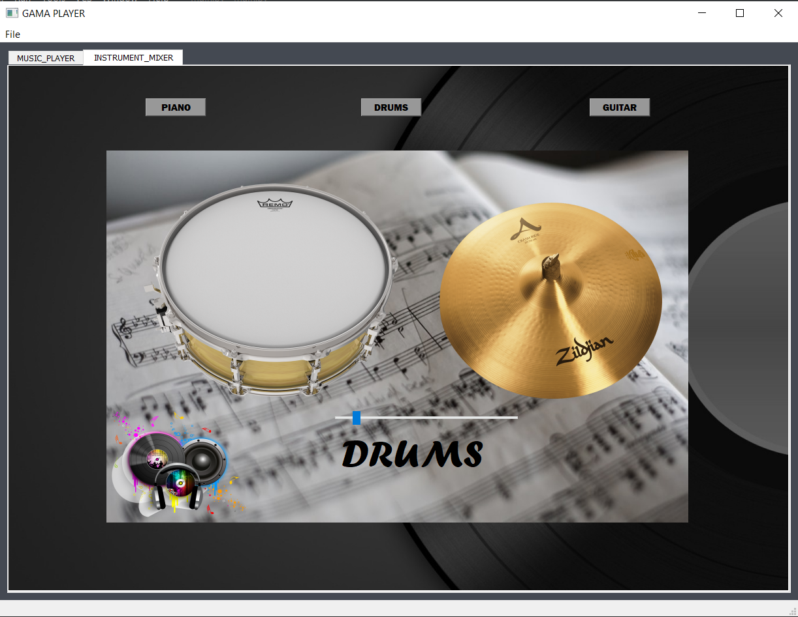
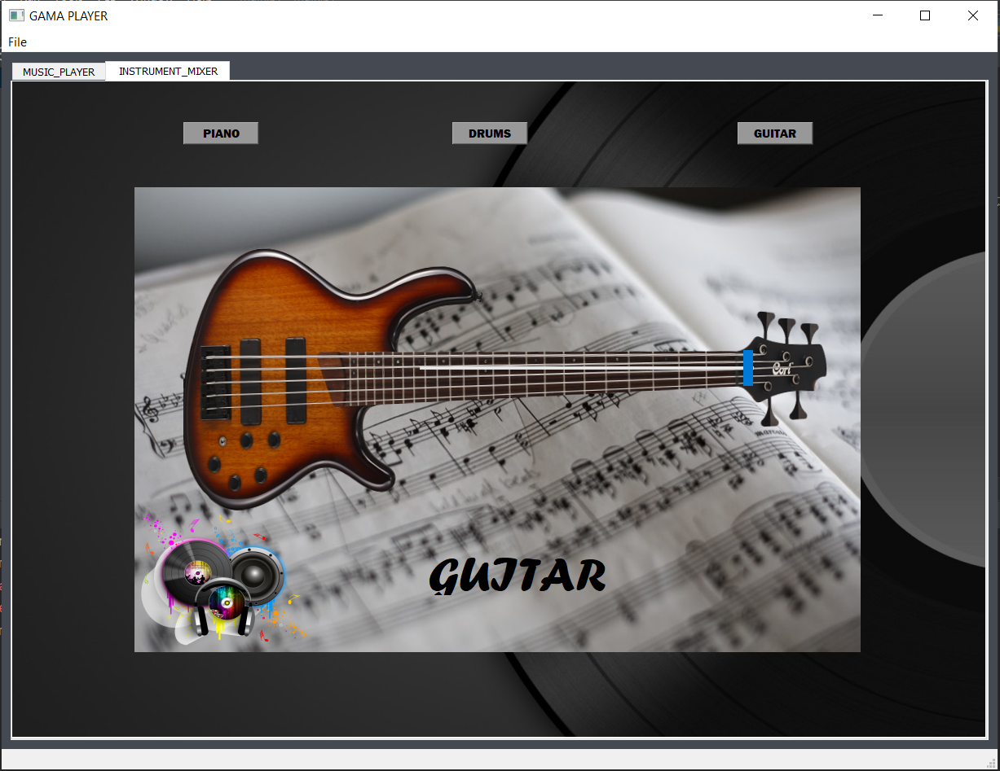
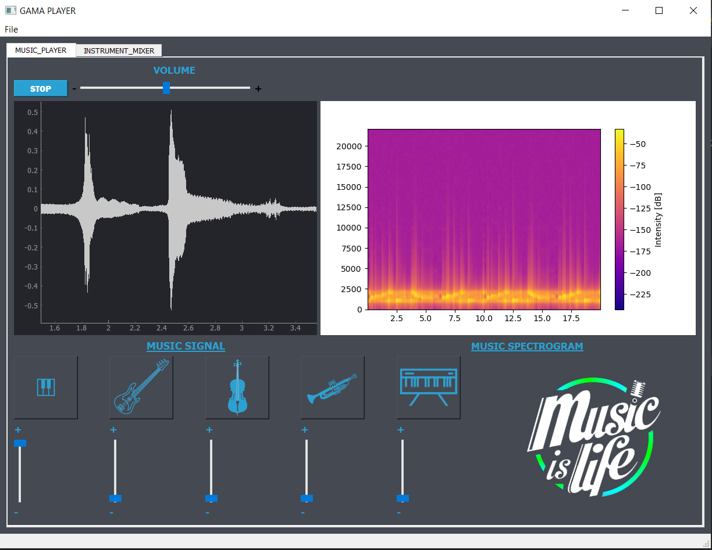

# Music-equalizer
Playing Music, Filtering music from some musical instruments, playing on some musical instrument and Controlling music.

(note: to show photos of music instruments on each slider in the equalizer you should put the path of the photo in your computer in finalgui.py file you will find the photos in photos file)

